# ddm_client SDK (Python)

**ddm_client SDK** is a Python client library for interacting with **DDM** as part of the **ExtremeXP** project.

This repository is published under:

- **extremexp-HORIZON / DDM**  
  https://github.com/extremexp-HORIZON/DDM

---

## Overview

This package provides:
- A Python SDK for working with the **DDM** endpoints
- A testing suite using **pytest**
- Challenge scripts used for integration demos / project milestones
- Optional blockchain interactions on any **EVM-compatible** network (**DDM-NFT-Provenance smart contracts** deployed on **Ethereum Sepolia** via **Infura**)

---

## Requirements

- Python **3.10+**
- Dependencies are managed via `pyproject.toml`

Dependencies:
- `requests`
- `python-dotenv`
- `web3==7.8.0`

---

## Installation

### ✅ Production install (SDK only)

Install from source locally:

```bash
pip install .
```

### ✅ Development install (SDK + tests)

Editable mode :

```bash
pip install -e .
```
Editable Mode + Tests (recommended during development)
```bash
pip install -e ".[dev]"
```

---

## Configuration (.env)

This project expects environment variables from a `.env` file.


### Sepolia + Infura (blockchain features)

Blockchain scripts/tests interact with smart contracts on **Sepolia**. For that you need:

1) **An RPC endpoint** (recommended: **Infura Sepolia**)
2) **A funded Sepolia account private key** (for signing transactions)

> ⚠️ Never commit real private keys to git. Use a local `.env`.

### Example `.env`

```env
# --- core ---
DDM_BASE_URL=https://ddm.extremexp-icom.intracom-telecom.com
DDM_AUTH_URL=https://ddm.extremexp-icom.intracom-telecom.com
DDM_TIMEOUT=30

# --- auth ---
DDM_USERNAME=
DDM_PASSWORD=

# Ethereum accounts (private keys) used by scripts/tests for uploader and human validator
# IMPORTANT: keep these private and local
DDM_USER_PK=0x...
DDM_HUMANVAL_PK=0x...

# Sepolia RPC (Infura)
SEPOLIA_RPC_URL=https://sepolia.infura.io/v3/<YOUR_INFURA_PROJECT_ID>
DDM_RPC_URL=https://sepolia.infura.io/v3/<YOUR_INFURA_PROJECT_ID>

# --- storage ---
DDM_STORAGE_DIR=out/runtime
```

---


## Getting Sepolia RPC + MetaMask Key

### 1) MetaMask wallet
- Install the **MetaMask** browser extension:  
  https://metamask.io/download
- Create a wallet account
- Enable **Sepolia test network** in MetaMask

### 2) Infura Sepolia RPC
- Visit Infura Documentation 
  https://docs.metamask.io/services/get-started/infura
- Create an Infura account + project:  
  https://www.infura.io/
- Copy your Sepolia endpoint:
  `https://sepolia.infura.io/v3/<PROJECT_ID>`
- Put it in `.env` as:
  - `SEPOLIA_RPC_URL`
  - `DDM_RPC_URL` (if needed by the SDK/scripts)

### 3) Export private key
In MetaMask:
- Account details → **Export Private Key**
- Put it into `.env` as `DDM_USER_PK=0x...`

> Security note: do this only on a trusted machine and never share/commit the key.

### 4) Fund with Sepolia ETH
You’ll need Sepolia ETH for gas to run on-chain interactions.

You can use the Chainlink faucet (official):
- https://faucet.chainstack.com/sepolia-testnet-faucet

Alternative:
- Login to https://ddm.extremexp-icom.intracom-telecom.com/
- **Edit** your profile to save your public key  
- A tip will be transferred to your wallet

---

## Quick Start

Upload a file using the SDK:

```python
from __future__ import annotations

import os
from pathlib import Path

from ddm_sdk.client import DdmClient


def main() -> None:
    client = DdmClient.from_env()

    username = os.getenv("DDM_USERNAME")
    password = os.getenv("DDM_PASSWORD")

    if username and password:
        client.login(username, password)

    sample_path = os.getenv("DDM_SAMPLE_FILE_PATH")
    if not Path(sample_path).exists():
        print("Missing sample:", sample_path)
        return

    project_id = os.getenv("DDM_TEST_PROJECT_ID")

    resp = client.files.upload(
        project_id=project_id,
        files=[sample_path],
        user_filenames=["my_clean_data.csv"],
        descriptions=["training dataset"],
        use_case=[["ml", "forecasting"]],
    )


if __name__ == "__main__":
    main()
```


---

## Tests (pytest)

<details>
<summary><strong>Commands + screenshots</strong></summary>

### Install test dependencies

```bash
pip install -e ".[dev]"
```

### Run all tests

```bash
pytest
```

### Blockchain-enabled tests (Sepolia)

If you run blockchain tests, make sure your `.env` includes:
- `SEPOLIA_RPC_URL` / `DDM_RPC_URL`
- a signing key such as `DDM_USER_PK` (and optionally `DDM_HUMANVAL_PK`)

### Run test folders (from project root)

1) **catalog**
```bash
pytest tests/catalog
```


2) **file**
```bash
pytest tests/file
```
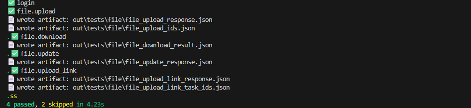

3) **files**
```bash
pytest tests/files
```
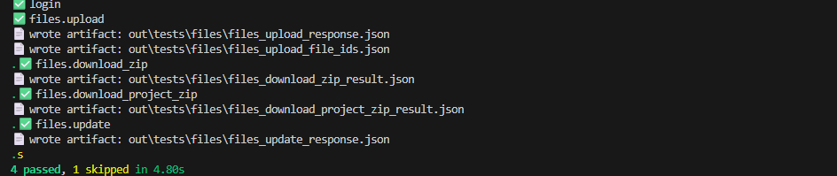

4) **file_metadata**
```bash
pytest tests/file_metadata
```
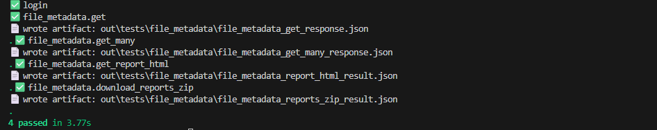

5) **uploader_metadata**
```bash
pytest tests/uploader_metadata
```
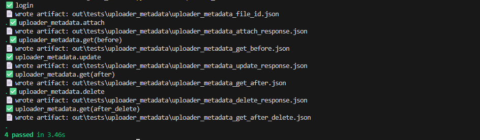

6) **expectations**
```bash
pytest tests/expectations
```
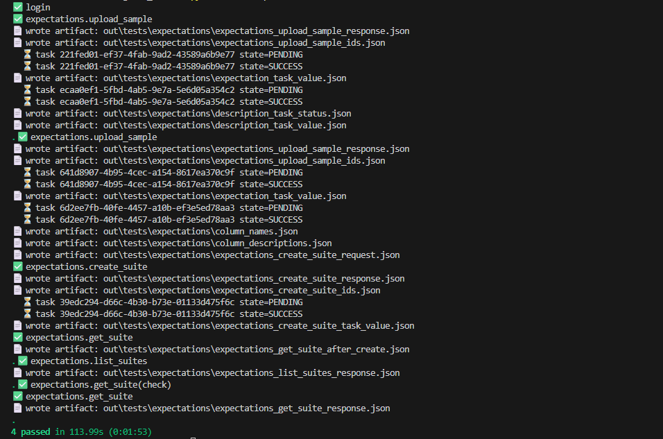

7) **validations**
```bash
pytest tests/validations
```
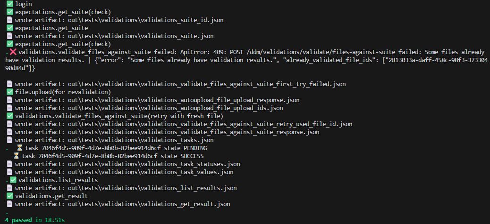

8) **parametrics**
```bash
pytest tests/parametrics
```
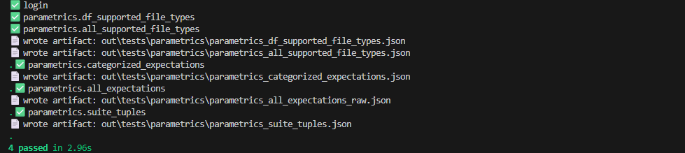

9) **user**
```bash
pytest tests/user
```
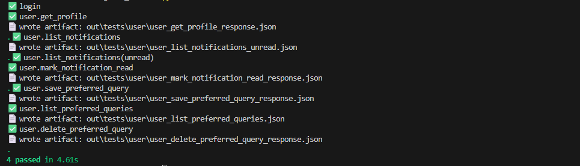

10) **blockchain**
```bash
pytest tests/blockchain
```
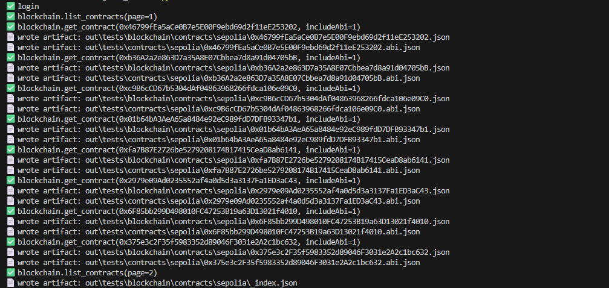

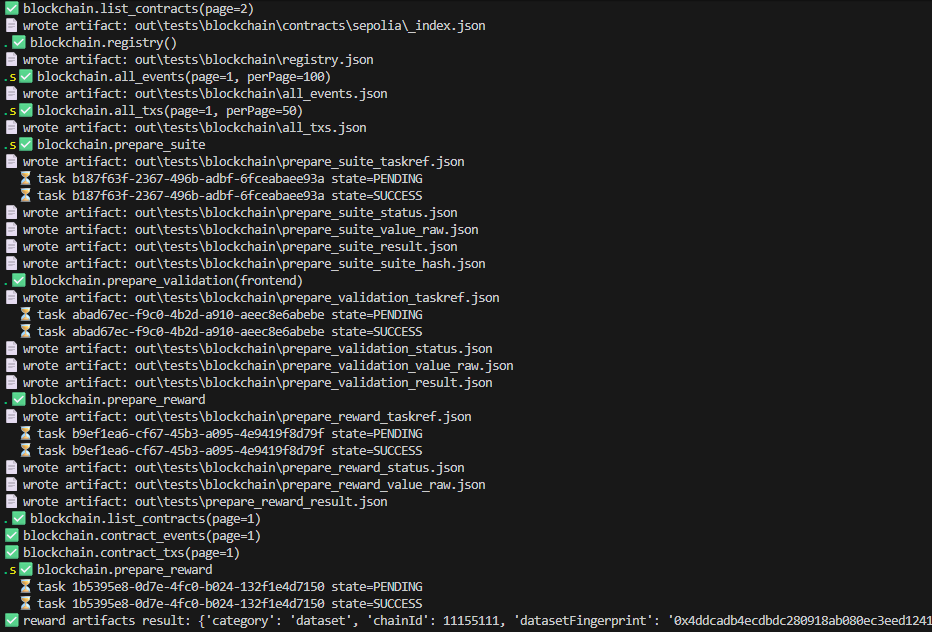

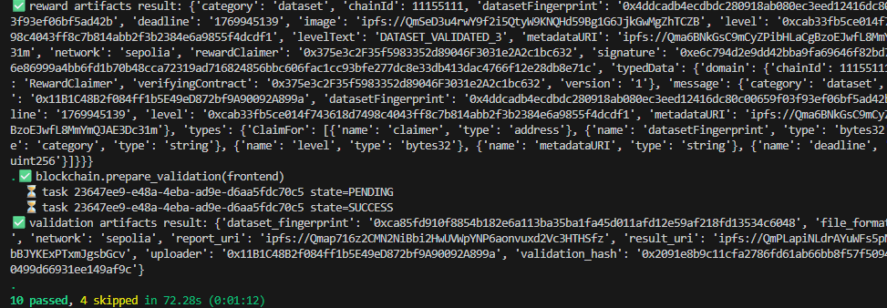

### Useful pytest flags

Verbose output:
```bash
pytest -vv
```

Stop after first failure:
```bash
pytest -x
```

</details>

---
## Challenges

This repository includes two guided challenge/tutorial folders:

- `challenges/challenge_05_ddm_access_control`
- `challenges/challenge_08_nft_provenance`

<details>
<summary><strong>Challenge 05 — DDM & Access Control</strong></summary>

📁 Folder:
```text
challenges/challenge_05_ddm_access_control
```

📘 Full guide:
- [Challenge 05 README](./challenges/challenge_05_ddm_access_control/README.md)

</details>

<details>
<summary><strong>Challenge 08 — NFT Provenance (Sepolia)</strong></summary>

📁 Folder:
```text
challenges/challenge_08_nft_provenance
```

📘 Full guide:
- [Challenge 08 README](./challenges/challenge_08_nft_provenance/README.md)

⚠️ This challenge includes blockchain steps.  
Make sure your `.env` includes:
- `SEPOLIA_RPC_URL` / `DDM_RPC_URL`
- a private key like `DDM_USER_PK`

</details>

---


## License


This project is licensed under the **Apache License 2.0**.  
See the [LICENSE](./LICENSE) file for details.

---

## Acknowledgements

The ExtremeXP project is co-funded by the European Union Horizon Program **HORIZON CL4-2022-DATA-01-01**, under Grant Agreement No. **101093164**.
